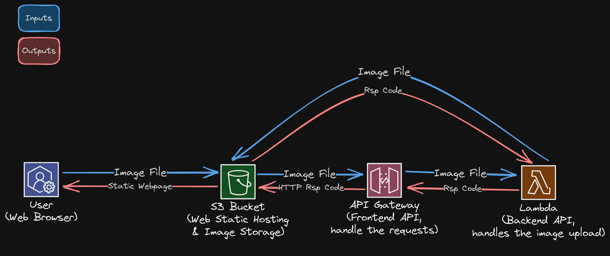

**Report: DevSecOps Infrastructure Deployment**

*Prepared for the Stakeholders of [Company Name]*

**Executive Summary**

This report provides an overview of the successful deployment of a DevSecOps infrastructure for Zurich Insurance. The project aimed to enable the team responsible for assessing damage to vehicles, to upload images through a user-friendly web interface and securely store them in a highly available and scalable environment. The infrastructure was designed using AWS services, including S3, Lambda, and API Gateway, with automation achieved through Terraform. This report outlines the architectural design, key decision-making process, and the achieved results.

**Architecture Diagram**

The following diagram presents the architecture and flow of the application:

**Thoughts on Design, Development, and Implementation Decisions**

1. **Choice of S3 for Image Storage**: We selected Amazon S3 as the storage solution for uploaded images due to its exceptional durability, scalability, and high availability. S3 provides a secure and reliable platform for storing image files. It also offers cost optimization by charging only for the storage used and data transfer, helping Zurich efficiently manage infrastructure expenses.

2. **Leveraging Serverless Architecture with Lambda**: We adopted a serverless architecture using AWS Lambda for the image processing logic. Lambda functions offer automatic scaling and resource provisioning, eliminating the need to manage servers manually. This results in cost optimization as you only pay for the actual execution time, reducing idle resource costs.

3. **Secure Communication with API Gateway**: To establish secure communication between the web interface and Lambda function, we employed AWS API Gateway. API Gateway acts as an HTTP endpoint, facilitating the integration between the static HTML webpage and Lambda. It ensures secure data transmission, handles request routing, and provides enhanced security features such as authentication and rate limiting.

4. **Automation with Terraform**: We implemented the infrastructure deployment and management using Terraform, an infrastructure as code tool. Terraform enables automation, consistency, and scalability by defining infrastructure resources as code. This approach ensures repeatability and eliminates manual configuration errors, streamlining the deployment process.

**Conclusion**

The deployment of the DevSecOps infrastructure has provided Zurich with a robust solution for image uploading and storage. The architectural design, incorporating AWS services such as S3, Lambda, and API Gateway, ensures high availability, scalability, and cost optimization.

Through the adoption of serverless computing, Zurich benefits from reduced infrastructure management overhead, allowing developers to focus on application logic rather than server provisioning. The integration of API Gateway ensures secure communication between the web interface and the Lambda function, protecting data during transmission.

The utilization of Terraform has empowered Zurich with automation capabilities, enabling streamlined infrastructure deployment, scaling, and maintenance. The infrastructure as code approach enhances collaboration, version control, and repeatability, ensuring consistent and reliable deployments.

In conclusion, the DevSecOps infrastructure deployment has provided Zurich with an efficient and secure solution for image uploading and storage. The selected architecture leverages AWS services, focusing on scalability, cost optimization, and ease of management. The automation capabilities of Terraform contribute to efficient infrastructure management and enable adaptability to future requirements.

We believe that this deployment will enhance the user experience, allowing seamless image uploads while ensuring data security and high availability. The DevSecOps team remains committed to supporting Zurich with ongoing maintenance and further enhancements as needed.

If you have any questions or require additional information, please feel free to reach out to the DevSecOps team.

Thank you for your trust and support.

Sincerely,

Jorge B.
Platform Engineer